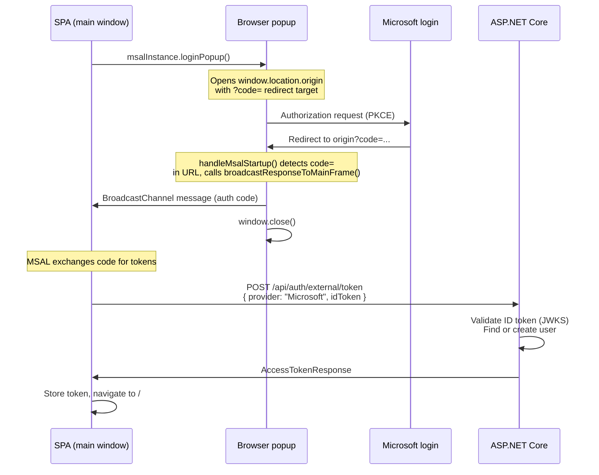
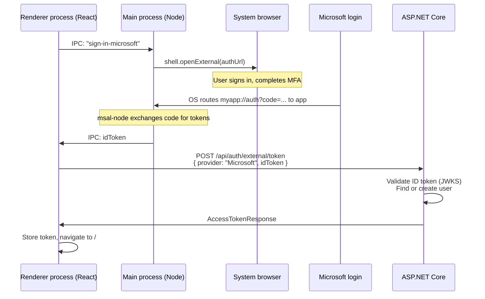
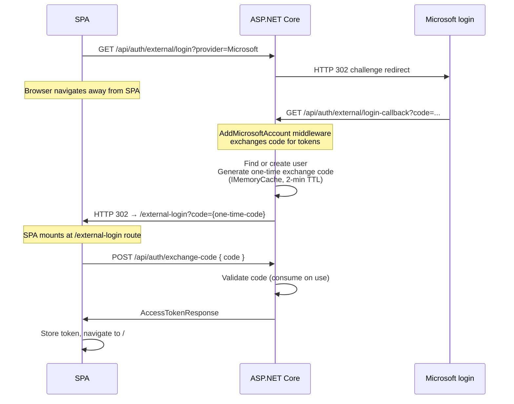

# OAuth Flow Comparison: Web Popup vs Electron vs Server Bridge

Three ways to implement Microsoft sign-in with an ASP.NET Core bearer-token API. All three end at the same place — a signed-in user with an `AccessTokenResponse` — but the path differs significantly.

---

## Quick Summary

| | Approach A: Web popup (current) | Approach A′: Electron | Approach B: Server bridge |
|---|---|---|---|
| **Who initiates OAuth** | Browser (MSAL browser SDK) | App main process (MSAL node SDK) | Server (`AddMicrosoftAccount`) |
| **Where redirect lands** | Same browser origin | Custom URI scheme (`myapp://`) | Server callback endpoint |
| **Code exchange** | MSAL browser SDK (in popup) | MSAL node SDK (in main process) | ASP.NET Core middleware |
| **What server receives** | Validated ID token | Validated ID token | Nothing — it does the exchange |
| **Server contract** | `POST /api/auth/external/token` | `POST /api/auth/external/token` | `POST /api/auth/exchange-code` |
| **Server changes for Electron** | None | None | N/A |
| **Works for mobile** | No | N/A | Difficult |
| **Client-side SDK** | `@azure/msal-browser` | `@azure/msal-node` | None |

---

## Approach A: Web Browser Popup (Implemented)

The browser's MSAL SDK opens a popup window, handles the full Authorization Code + PKCE flow inside it, and returns an ID token to the calling window via `BroadcastChannel`.

**Key implementation details:**
- `handleMsalStartup()` runs before React mounts. If `code=` is in the URL, it calls `broadcastResponseToMainFrame()` and closes the popup — React never mounts in the popup.
- `cacheLocation: 'localStorage'` persists the MSAL session across browser sessions, avoiding repeated MFA prompts.
- `popupBridgeTimeout: 180_000` — the clock starts when the popup opens. 3 minutes covers MFA and slow connections.
- `overrideInteractionInProgress: true` on `loginPopup` cancels stale locks from previously closed popups.

---

## Approach A′: Electron (Not yet implemented)

The Electron main process initiates the OAuth flow using `msal-node`. Microsoft redirects to a custom URI scheme registered with the OS. The main process receives the redirect, completes the code exchange, and passes the ID token to the renderer. The renderer POSTs it to the same server endpoint as Approach A.

**Key implementation details:**
- Uses `@azure/msal-node` (not `@azure/msal-browser`) — the Node.js MSAL library handles PKCE and code exchange in the main process.
- A custom URI scheme (e.g., `myapp://auth`) must be registered with the OS via Electron's `app.setAsDefaultProtocolClient('myapp')`.
- The `redirectUri` in the Azure AD app registration must include the custom scheme URI (e.g., `myapp://auth`).
- The renderer never touches the OAuth code — it only receives the finished ID token via IPC.
- The server endpoint is identical to Approach A. No server changes required.
- `microsoftProvider.ts` would need an Electron-specific variant (or a runtime branch detecting `window.electron`) that sends an IPC message instead of calling `msalInstance.loginPopup()`.

---

## Approach B: Server-Side Exchange Code Bridge (Not implemented)

The server handles the full OAuth redirect dance using ASP.NET Core's `AddMicrosoftAccount`. After the callback, the server generates a short-lived one-time code and redirects the SPA to `/external-login?code=...`. The SPA redeems it for a bearer token.

**Key implementation details:**
- The SPA navigates *away* entirely — the React app unmounts and remounts at the `/external-login` route.
- The exchange code is a custom security-sensitive piece: must be single-use, short-lived (2 min), and protected against fixation attacks.
- Requires `Microsoft.AspNetCore.Authentication.MicrosoftAccount` NuGet package and a `ClientSecret` in server config (not needed for Approaches A/A′).
- Does not work cleanly for mobile (no equivalent of a server redirect landing point without deep links / universal links).
- Does not give the client an MSAL session — Graph API tokens for SharePoint/OneDrive would require a separate OAuth flow later.
- No official Microsoft documentation or ASP.NET Core sample for this specific combination with `AddIdentityApiEndpoints`.

---

## Why Approach A was chosen

The decision is documented in detail in [`microsoft-oauth-integration.md`](./microsoft-oauth-integration.md#three-options). In short:

- Approach B requires a `ClientSecret` on the server, a custom security-sensitive exchange code, and breaks the SPA's single-page model (full navigation away and back).
- Approach A keeps the server stateless with respect to OAuth — it only validates a JWT it receives. The client-side SDK handles all state.
- Approach A′ (Electron) reuses the same server contract, so adding Electron support later requires no server changes.
