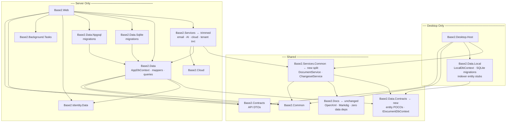

**User**

I would like to think about this again. We decided that a separate Data.Local and shared Data.Contracts project makes sense. I'm still unclear about the services level. It seems like Services is server side and is a superset of Services.Common (or whatever we call it), which will be used both on the server and the desktop. Can you draw a dependency graph of both environments and the projects that are shared and unique to each?

**System**

Good — I now have a complete picture of the current project references. There are a few important things to notice before drawing the graph:

1. `Base2.Docs` already has **zero project references** — it's a pure doc-processing library (OpenXml/Markdig). It's already naturally shared.
2. `Base2.Desktop.Host` currently references `Base2.Services` and `Base2.Data` directly, which means it pulls in `AppDbContext`, Identity tables, and all server-specific infrastructure. That's what the split is fixing.
3. The reason a `Services.Common` split is necessary (not just using `IDocumentDbContext` in the existing `Base2.Services`) is that `Services` depends on `Base2.Data` — so even if `DocumentService` only uses `IDocumentDbContext`, `Desktop.Host` would still compile in the full server context through the transitive reference. The split cuts that link.

Here is the proposed dependency graph for the post-restructure state:

---

### How to read this

**The `Services` superset relationship** works via a direct project reference: `Base2.Services` → `Base2.Services.Common`. The server gets everything; the desktop gets only the common slice.

**The two `IDocumentDbContext` wires:**

| Environment | Implementation | Registered by |
|---|---|---|
| Server | `AppDbContext` | `Base2.Data`'s `AddAppDbConfiguration` |
| Desktop | `LocalDbContext` | `Base2.Data.Local`'s `AddLocalDb` |

`Base2.Services.Common` sees only the interface — it never knows which context is behind it.

**`Base2.Docs` is already clean.** It has no data dependencies today, so it slots naturally into the shared zone with no changes needed.

---

### What moves vs. what stays

| Project | Change |
|---|---|
| `Base2.Services.Common` | **New.** Extract `DocumentService`, `ChangesetService` from `Services` |
| `Base2.Data.Contracts` | **New.** Entity POCOs + `IDocumentDbContext` (from the existing plan) |
| `Base2.Data.Local` | **New.** `LocalDbContext`, migrations, indexer stubs (from the existing plan) |
| `Base2.Services` | **Trimmed.** Drops doc services, adds ref to `Services.Common` and keeps `Data` + `Cloud` |
| `Base2.Desktop.Host` | **Rewired.** Drops `Services` + `Data` + `Data.Sqlite`, adds `Services.Common` + `Data.Local` |
| Everything else | Unchanged from the existing plan |

The one open question is the **name** — `Services.Common` is conventional but generic. If `DocumentService` and `ChangesetService` are the only things that cross environments, `Base2.Services.Docs` would be more precise. Worth settling before creating the project.