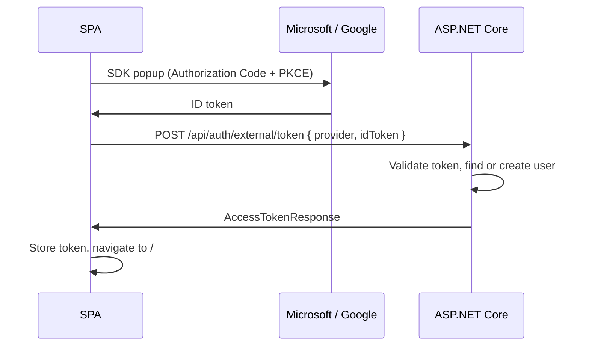

# External OAuth Integration (Microsoft + Google)

**Date:** 2026-02-27
**Scope:** Fullstack — server + client
**Status:** Microsoft complete. Google deferred.

See [`guides/server/microsoft-oauth-integration.md`](../../guides/server/microsoft-oauth-integration.md) for the full architecture decision, options comparison, friction points, implementation notes, and debugging findings.

## Approach chosen

**Approach A: Client-side ID token.** Each provider's SDK handles the OAuth popup. The SDK returns an ID token. The SPA POSTs it to `POST /api/auth/external/token`, which validates and issues a normal `AccessTokenResponse`. The same MSAL session can later acquire Graph API tokens for SharePoint/OneDrive without re-authentication.



---

## What was built

### Server

**New files / changes:**

- [`Base2.Services/src/Identity/ExternalAuthSettings.cs`](../../../src/server/Base2.Services/src/Identity/ExternalAuthSettings.cs) — `ExternalAuthSettings`, `MicrosoftAuthSettings`, `GoogleAuthSettings`
- [`Base2.Services/src/Identity/ITenantProvisioningService.cs`](../../../src/server/Base2.Services/src/Identity/ITenantProvisioningService.cs) — interface for tenant provisioning on new user creation
- [`Base2.Services/src/Identity/TenantProvisioningService.cs`](../../../src/server/Base2.Services/src/Identity/TenantProvisioningService.cs) — stub implementation (no-op; `ApplicationUser` constructor handles debug tenant)
- [`Base2.Services/src/Extensions/IServiceCollectionExtensions.cs`](../../../src/server/Base2.Services/src/Extensions/IServiceCollectionExtensions.cs) — registered `ITenantProvisioningService`
- [`Base2.Services/src/Extensions/SettingsServiceCollectionExtensions.cs`](../../../src/server/Base2.Services/src/Extensions/SettingsServiceCollectionExtensions.cs) — configured `ExternalAuthSettings` from `"ExternalAuth"` config section
- [`Base2.Web/src/Controllers/Auth/ExternalController.cs`](../../../src/server/Base2.Web/src/Controllers/Auth/ExternalController.cs) — new controller
- [`Base2.Web/src/appsettings.json`](../../../src/server/Base2.Web/src/appsettings.json) — replaced `Office365Settings` with `ExternalAuth` section
- [`Base2.Web/src/appsettings.Development.json`](../../../src/server/Base2.Web/src/appsettings.Development.json) — populated `ExternalAuth` with dev credentials
- [`Directory.Packages.props`](../../../src/server/Directory.Packages.props) — added `System.IdentityModel.Tokens.Jwt`
- [`Base2.Web.csproj`](../../../src/server/Base2.Web/src/Base2.Web.csproj) — added `PackageReference` for `System.IdentityModel.Tokens.Jwt`

**Controller routes:**

```
POST   /api/auth/external/token           [AllowAnonymous]  — validate ID token, issue bearer token
GET    /api/auth/external/logins          [Authorize]       — list linked providers for current user
DELETE /api/auth/external/login/{provider} [Authorize]      — unlink a provider
```

**Controller naming note:** The class is named `ExternalController` (not `ExternalAuthController`). With `[Route("api/[area]/[controller]")]`, the `[controller]` token expands to the class name minus the `Controller` suffix — `ExternalAuthController` would produce `externalauth`, not `external`.

**Token validation:** Manual JWT validation using `Microsoft.IdentityModel.Tokens` + `System.IdentityModel.Tokens.Jwt`. `Microsoft.Identity.Web` was deliberately avoided — it registers a new auth scheme that would conflict with `IdentityConstants.BearerScheme`.

**After `SignInAsync`:** Returns `new EmptyResult()`. `BearerTokenHandler.HandleSignInAsync` writes the `AccessTokenResponse` directly to the HTTP response body; returning `Ok()` after that throws "response already started". `EmptyResult.ExecuteResult` is a no-op.

### Client

**New / changed files:**

- [`common/src/features/auth/providers/microsoftProvider.ts`](../../../src/client/common/src/features/auth/providers/microsoftProvider.ts) — MSAL instance, `handleMsalStartup`, `signInWithMicrosoft`, `acquireGraphToken`
- [`common/src/features/auth/api/authApi.ts`](../../../src/client/common/src/features/auth/api/authApi.ts) — added `postExternalToken`
- [`common/src/features/auth/stores/authStore.ts`](../../../src/client/common/src/features/auth/stores/authStore.ts) — added `externalLogin` state and `loginWithMicrosoft` action
- [`common/src/features/auth/components/AuthCard.tsx`](../../../src/client/common/src/features/auth/components/AuthCard.tsx) — wired "Continue with Microsoft" button; added `pendingExternalSignIn` ref and navigation effect
- [`web/src/main.tsx`](../../../src/client/web/src/main.tsx) — calls `handleMsalStartup()` before mounting React
- [`web/.env.example`](../../../src/client/web/.env.example) — added `VITE_MICROSOFT_CLIENT_ID`, `VITE_MICROSOFT_TENANT_ID`, `VITE_GOOGLE_CLIENT_ID`
- [`common/package.json`](../../../src/client/common/package.json) — added `@azure/msal-browser ^5.3.0`

**`microsoftProvider.ts` summary:**

```typescript
// handleMsalStartup — called from main.tsx before createRoot().render()
// Returns true if this window is an MSAL popup redirect (skip mounting React).
export async function handleMsalStartup(): Promise<boolean> {
  const isPopupRedirect =
    window.location.search.includes('code=') || ...;
  if (isPopupRedirect) {
    try { await broadcastResponseToMainFrame(); } catch { }
    window.close();
    return true;
  }
  await msalInstance.initialize().catch(() => {});
  return false;
}

// signInWithMicrosoft — tries silent token first, falls back to popup
export const signInWithMicrosoft = async (): Promise<string> => {
  const account = msalInstance.getAllAccounts()[0];
  if (account) {
    try {
      return (await msalInstance.acquireTokenSilent({ scopes, account })).idToken;
    } catch { }
  }
  return (await msalInstance.loginPopup({ scopes, overrideInteractionInProgress: true })).idToken;
};
```

**`main.tsx`:**

```typescript
if (!await handleMsalStartup()) {
  createRoot(document.getElementById('root')!).render(...);
}
```

---

## Key implementation findings

Full details in [`guides/server/microsoft-oauth-integration.md#implementation-notes`](../../guides/server/microsoft-oauth-integration.md#implementation-notes). Summary:

1. **MSAL v5 uses `BroadcastChannel`, not `window.opener.postMessage`.** The popup must call `broadcastResponseToMainFrame()` from `@azure/msal-browser/redirect-bridge` to post the auth code back. Calling `msalInstance.initialize()` in the popup does nothing useful.

2. **`handleMsalStartup` must be a called function, not a module-level promise.** A module-level `const x = (async () => { ... })()` is evaluated once and cached. Using a plain exported function called from `main.tsx` guarantees it runs fresh on every page load, including the popup's.

3. **`popupBridgeTimeout` must cover the full login round-trip.** The clock starts when the popup opens, not when the user finishes. Set to 180,000 ms (3 minutes). The default 60 s is too short for users on slow connections or going through MFA.

4. **`overrideInteractionInProgress: true`** on `loginPopup` cancels any stale pending interaction lock from a previously closed popup, allowing immediate retry.

5. **`acquireTokenSilent` before `loginPopup`** — if MSAL has a cached account, the silent call returns the ID token without opening a popup at all. This avoids repeated MFA prompts for returning users.

6. **`cacheLocation: 'localStorage'`** — persists the MSAL session across browser sessions. The default `sessionStorage` clears on tab close, requiring re-authentication every session.

7. **Navigation after Microsoft sign-in** — `AuthCard` uses a `pendingExternalSignIn` ref set on button click. A `useEffect` on `externalLoginStatus` navigates when status transitions to `'idle'` with the flag set and `userModel` present. The store awaits `getUser()` before setting `'idle'` to ensure `userModel` is populated when the effect fires.

---

## Deferred: Google

Google OAuth (Approach A using Google Identity Services) is designed and documented but not implemented. The server endpoint (`POST /api/auth/external/token`) already accepts `provider: "Google"` — only the client provider and the server `ValidateGoogleTokenAsync` method need to be added.

See the guide for the planned `googleProvider.ts` implementation.

---

## Azure AD app registration

See [`guides/server/azure-ad-app-registration.md`](../../guides/server/azure-ad-app-registration.md).

Active registration: SPA client `8609c8d6-b2aa-4c3b-acd6-3726699dfffe`, tenant `ece394e8-e931-4d2a-815a-52c26aa2c35e`.

Redirect URI registered: `http://localhost:8383` (origin only — no path suffix needed).
