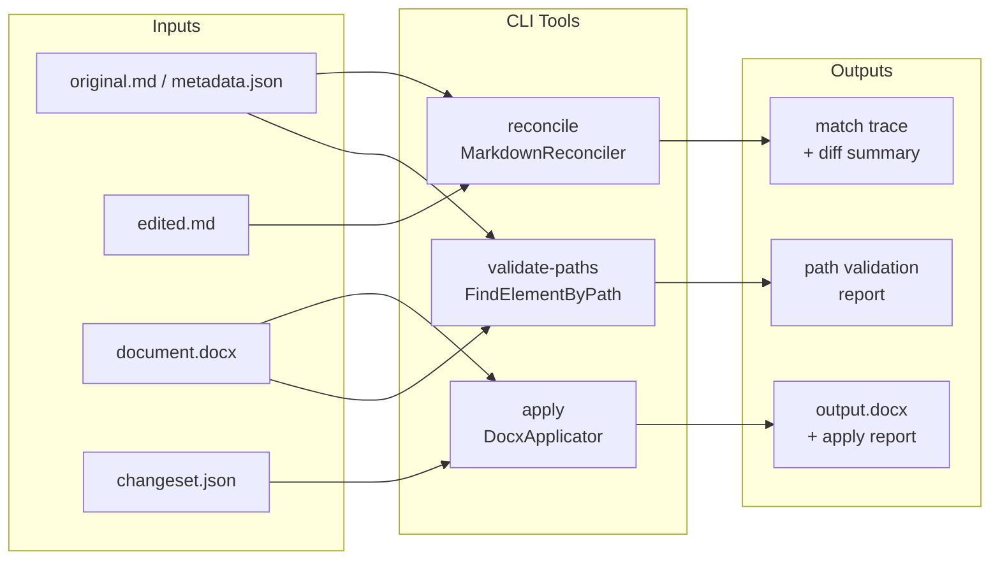

# Diff/Apply Debug Tools

**Version:** 0.1  
**Date:** February 21, 2026  
**Status:** Planning

---

## Summary

Three focused CLI commands, all living in a new `evaluator` console project under `src/tools/`:

- `reconcile` — run `MarkdownReconciler` against two markdown inputs and print a detailed match trace
- `apply` — run `DocxApplicator` against a DOCX + changeset JSON and write out the result
- `validate-paths` — check that every OpenXML path in a `DocumentMetadata` JSON still resolves in a given DOCX

Plus fixture helpers and snapshot tests added to the existing `Base2.Docs.Test` project.

---

## Pipeline Overview

```
Inputs                          Tool                    Output
──────────────────────────────────────────────────────────────────
original.md + metadata.json  ─┐
edited.md                    ─┴─►  reconcile  ──►  match trace + diff.json

input.docx                   ─┐
changeset.json               ─┴─►  apply      ──►  output.docx + apply report

document.docx                ─┐
metadata.json                ─┴─►  validate-paths  ──►  path validation report
```

---

## Pipeline overview diagram



## Tool 1: `reconcile`

**Purpose:** Given two markdown files (original and LLM-edited), run the reconciler and print exactly what matched, why, and what was left unmatched.

**Usage:**
```
evaluator reconcile --original original.md --edited edited.md [--metadata metadata.json] [--threshold 0.7] [--out diff.json]
```

**Output (stdout):**
- Per-element match table: edited content → matched original ID, strategy used (exact / heading-fuzzy / paragraph-fuzzy / unmatched), similarity score
- Summary: N updates, N inserts, N deletes
- JSON diff written to `--out diff.json` if requested

**Key change needed in `MarkdownReconciler`:** Extract match reasoning into a `ReconcileTrace` return type (alongside `DocumentChanges`) so the CLI can print it without re-implementing the logic. Small, non-breaking addition.

**Where input data comes from:**
- `original.md` — exported from a real document, or written by hand for test cases
- `edited.md` — the raw LLM output, copy-pasted or piped from a chat session
- `metadata.json` — serialized `DocumentMetadata`, exported alongside `original.md`

---

## Tool 2: `apply`

**Purpose:** Apply a changeset to a DOCX file locally, without cloud storage or a running server.

**Usage:**
```
evaluator apply --docx input.docx --changeset changeset.json [--metadata metadata.json] [--out output.docx] [--dry-run]
```

**Output:**
- `output.docx` with changes applied
- Apply report to stdout: each operation (update / delete / insert), whether it succeeded or was skipped, and the reason (path not found, element not paragraph, etc.)
- `--dry-run` prints the report without writing the output file

**Key change needed in `DocxApplicator`:** Surface the per-operation results that are currently only logged as `LogWarning`/`LogDebug` into a structured `ApplyReport` return type. Logger calls stay; the report is additive.

**Where input data comes from:**
- `input.docx` — a real document downloaded from cloud storage, or a synthetic test fixture
- `changeset.json` — serialized `DocumentChanges`, either exported from the DB or produced by `reconcile --out`

---

## Tool 3: `validate-paths`

**Purpose:** Given a DOCX and a `DocumentMetadata` JSON, verify that every stored OpenXML path still resolves to the expected element content. Catches stale paths before an apply attempt.

**Usage:**
```
evaluator validate-paths --docx document.docx --metadata metadata.json
```

**Output:**
- Table of element IDs: path, expected content (from metadata), actual content found at that path (or NOT FOUND), and a PASS/FAIL status
- Exit code 1 if any paths fail (useful in CI)

**No changes needed** to existing production code — this tool calls the already-public `FindElementByPath` logic (or a thin wrapper around it).

---

## Supporting: Fixture Helpers & Reconciler Trace in Tests

The existing `Base2.Docs.Test` project gets:

- `ReconcilerFixture` — fluent builder for `(originalMarkdown, editedMarkdown)` pairs covering known scenarios (insert at top, delete middle, update heading, etc.)
- `MatchTraceAssertion` — assertion helpers that check which strategy was used for a given element, making reconciler tests more expressive than just checking counts
- Snapshot tests — serialize `DocumentChanges` to a stable text format and compare against checked-in `.snap` files; any change to matching logic shows up immediately as a diff

---

## New Project: `evaluator` (tools)

- Console app (`Microsoft.NET.Sdk`)
- Located at `src/tools/evaluator/` — separate from the server solution
- References `Base2.Docs` assembly (reconciler + applicator) as a project reference
- Uses `System.CommandLine` for argument parsing
- Three subcommands: `reconcile`, `apply`, `validate-paths`
- Single entry point, single binary: `evaluator`

---

## Files Touched

- `src/server/Base2.Docs/src/Reconciliation/MarkdownReconciler.cs` — add `ReconcileTrace` output
- `src/server/Base2.Docs/src/Application/DocxApplicator.cs` — add `ApplyReport` output
- `src/tools/evaluator/` — new project (entry point + 3 command files)
- `src/server/Base2.Docs.Test/` — fixture helpers and snapshot tests
